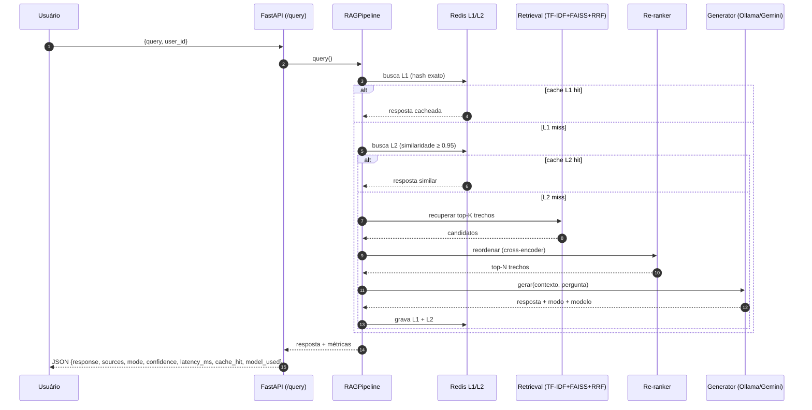

# Pipeline RAG

Esta página descreve o caminho completo de uma pergunta, desde a chegada no
endpoint `POST /query` até a resposta final. A orquestração vive em
`src/rag/pipeline.py`.

## Fluxo de uma consulta



## Etapas

### 1. Cache (Redis)

- **L1 — correspondência exata:** hash da pergunta normalizada. TTL padrão de
  7 dias (`CACHE_L1_TTL`).
- **L2 — similaridade semântica:** compara o embedding da pergunta com perguntas
  anteriores; reaproveita se a similaridade de cosseno ≥
  `CACHE_L2_SIMILARITY_THRESHOLD` (padrão 0.95). TTL de 30 dias (`CACHE_L2_TTL`).

O campo `cache_hit` da resposta indica `none`, `l1` ou `l2`.

### 2. Recuperação híbrida

Combina dois recuperadores sobre os mesmos *chunks*:

- **Esparso (TF-IDF):** bom para correspondência léxica exata (códigos,
  siglas, nomes de disciplinas).
- **Denso (FAISS + embeddings `multilingual-e5-base`):** captura similaridade
  semântica.

Os rankings são fundidos por **Reciprocal Rank Fusion (RRF)**, ponderados por
`RETRIEVAL_TFIDF_WEIGHT` (0.4) e `RETRIEVAL_DENSE_WEIGHT` (0.6). Retorna
`RETRIEVAL_TOP_K` candidatos (padrão 6). Detalhes da decisão no
[ADR-0001](decisoes/0001-rag-hibrido-tfidf-faiss-rrf.md).

### 3. Re-ranking

Um **cross-encoder multilíngue** (`RERANKER_MODEL`) reavalia a relevância de
cada candidato em relação à pergunta e mantém os `RERANKER_TOP_K` melhores
(padrão 2). Isso reduz ruído no contexto enviado ao LLM.

### 4. Geração

Segundo a estratégia `LLM_STRATEGY`:

- `local_first` (padrão): tenta **Ollama**; se falhar ou a confiança ficar
  abaixo de `CONFIDENCE_THRESHOLD`, faz *fallback* para **Gemini**.
- `local_only`: nunca usa Gemini.
- `gemini_only`: pula o Ollama.

Há um *circuit breaker* para o Ollama e retentativas (`tenacity`). O campo
`mode` da resposta indica `local`, `fallback`, `cached` ou `forbidden`. Ver
[ADR-0002](decisoes/0002-local-first-ollama-fallback-gemini.md).

### 5. Guardrails

O gerador recusa processar temas que exigem análise individual da secretaria
(ex.: **outorga antecipada de grau**, **revisão de menção**, **aproveitamento
automático**, **reintegração**), respondendo com o contato oficial da
secretaria. Quando não há contexto relevante, responde que não encontrou a
informação e orienta a contatar a secretaria.

## Contrato da resposta

```json
{
  "response": "texto da resposta...",
  "sources": ["estagio.md"],
  "mode": "local",
  "confidence": 0.738,
  "latency_ms": 10990.2,
  "cache_hit": "none",
  "model_used": "qwen2.5:7b"
}
```

Ver detalhes em [Referência → API](../referencia/api.md).
