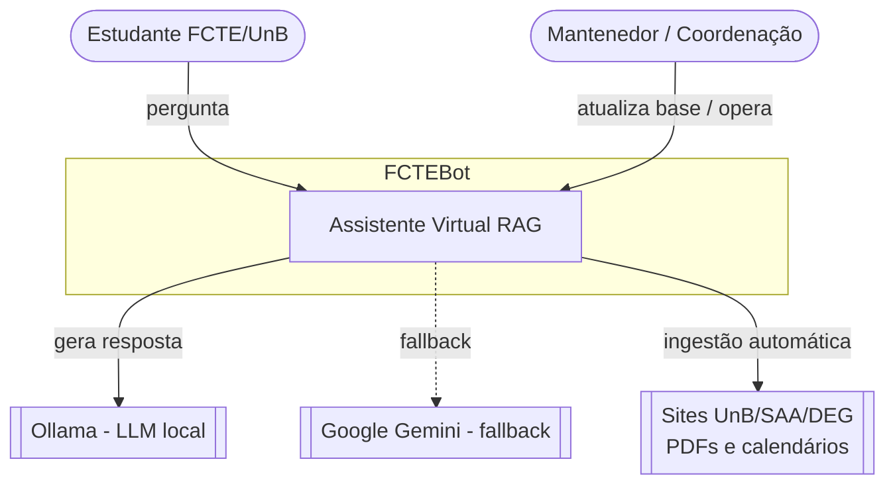
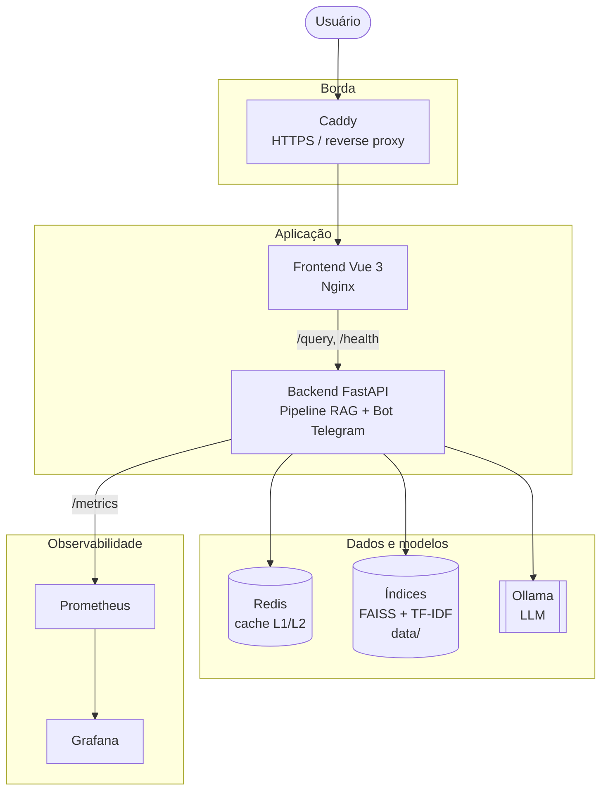
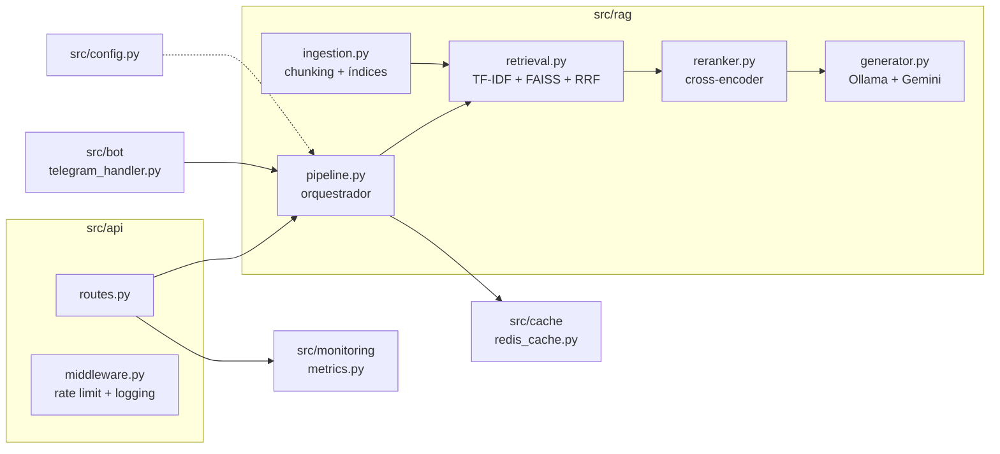

# Arquitetura — Visão geral

O FCTEBot segue uma arquitetura em camadas, orientada a um pipeline de
**Geração Aumentada por Recuperação (RAG)**. Esta página apresenta a visão
arquitetural no estilo **C4** (Contexto → Contêineres → Componentes).

## Nível 1 — Contexto

O sistema atende **estudantes** (via Telegram e web) e é mantido por um
**mantenedor** (dev/coordenação). Depende do **Ollama** para geração local, com
*fallback* opcional para o **Gemini**, e coleta conteúdo de **fontes oficiais da
UnB** para manter a base atualizada.

## Nível 2 — Contêineres

| Contêiner | Tecnologia | Porta (dev) | Responsabilidade |
|---|---|---|---|
| `fctebot-frontend` | Vue 3 + Nginx | 3000 | SPA de chat; proxy `/query` e `/health` para o backend |
| `fctebot-app` | FastAPI + Uvicorn | 8000 | API REST, pipeline RAG, bot Telegram, métricas |
| `fctebot-ollama` | Ollama | 11434 | Servidor de LLM local (ex.: `qwen2.5:7b`) |
| `fctebot-redis` | Redis 7 | 6379 | Cache multinível de respostas |
| `fctebot-prometheus` | Prometheus | 9090 | Coleta de métricas |
| `fctebot-grafana` | Grafana | 3001 | Dashboards e alertas |
| `caddy` (prod) | Caddy | 80/443 | TLS automático e reverse proxy |

!!! note "Portas"
    Em `docker-compose.yml` o **frontend** ocupa a `3000` e o **Grafana** a
    `3001`. Em produção (`docker-compose.prod.yml`) apenas 80/443 ficam
    expostas via Caddy.

## Nível 3 — Componentes do backend (`src/`)

Veja o detalhamento arquivo a arquivo em
[Desenvolvimento → Estrutura do código](../desenvolvimento/estrutura-codigo.md)
e o fluxo de uma consulta em [Pipeline RAG](pipeline-rag.md).

## Camadas (resumo lógico)

1. **Interface** — Telegram e frontend web.
2. **API** — FastAPI (`/query`, `/health`, `/webhook`, `/ingest`, `/cache`).
3. **Cache** — Redis L1 (correspondência exata) + L2 (similaridade semântica).
4. **Recuperação** — híbrida (TF-IDF esparso + FAISS denso), fundida por RRF.
5. **Re-ranking** — cross-encoder multilíngue reordena os melhores trechos.
6. **Geração** — Ollama (local-first) com *fallback* para Gemini.
7. **Observabilidade** — Prometheus + Grafana.

## Decisões arquiteturais

As principais escolhas estão registradas como
[ADRs](decisoes/index.md) — leia-os para entender *por que* cada componente
existe, quais alternativas foram consideradas e quais os trade-offs.
