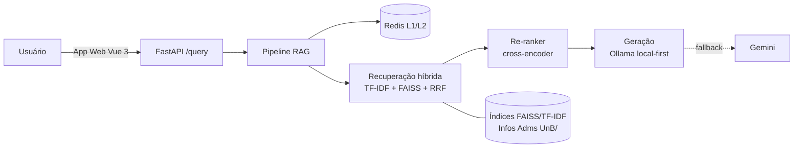

# FCTEBot — Documentação

**FCTEBot** é um assistente virtual educacional que responde a dúvidas
administrativas e acadêmicas de estudantes da **Faculdade de Ciências e
Tecnologias em Engenharia (FCTE/UnB)**, utilizando uma arquitetura de
**Geração Aumentada por Recuperação (RAG)** com abordagem **local-first**
(modelos de código aberto executados localmente, sem dependência obrigatória
de APIs pagas).

> **Contexto acadêmico.** Este projeto é o produto do Trabalho de Conclusão de
> Curso (TCC2) de **Caio Felipe Alves Braga**, do curso de Engenharia de
> Software da UnB/FCTE (2026). Título: *Otimização de Arquitetura RAG para
> Assistente Virtual Educacional: Uma Abordagem Local-First*.

---

## Por onde começar

=== "Quero entender o projeto"

    Leia [Arquitetura → Visão geral](arquitetura/visao-geral.md) e depois
    [Pipeline RAG](arquitetura/pipeline-rag.md). Para entender *por que* as
    decisões técnicas foram tomadas, veja os [ADRs](arquitetura/decisoes/index.md).

=== "Quero rodar localmente"

    Siga [Desenvolvimento → Setup local](desenvolvimento/setup-local.md).

=== "Quero operar em produção"

    Veja [Operação → Deploy](operacao/deploy.md) e o
    [Runbook](operacao/runbook.md) para o dia a dia.

=== "Quero atualizar a base de conhecimento"

    Veja [Base de conhecimento → Manual](base-conhecimento/manual.md).

=== "Vou assumir o projeto"

    Comece pelo [Handoff](continuidade/handoff.md), depois
    [Roadmap](continuidade/roadmap.md) e [Dívida técnica](continuidade/divida-tecnica.md).

---

## Visão em 30 segundos

- **Interface:** aplicação web em Vue 3 (interface oficial); bot do Telegram como canal opcional.
- **Backend:** FastAPI expõe `POST /query`, orquestrando o pipeline RAG.
- **Pipeline:** cache (Redis) → recuperação híbrida (TF-IDF + FAISS + RRF) →
  re-ranking (cross-encoder) → geração (Ollama local, com *fallback* Gemini).
- **Base de conhecimento:** ~45 documentos Markdown em `Infos Adms UnB/`,
  indexados em FAISS + TF-IDF.
- **Observabilidade:** métricas Prometheus + dashboards Grafana.



---

## Status da documentação

Esta documentação foi estruturada para dar **continuidade** ao projeto. Alguns
documentos estão completos e outros são esqueletos marcados com `TODO`, prontos
para serem preenchidos pelo mantenedor atual. Consulte a
[Dívida técnica](continuidade/divida-tecnica.md) para a lista de pendências
conhecidas.

## Como gerar este site

```bash
pip install -r requirements-docs.txt
mkdocs serve      # preview em http://127.0.0.1:8000
mkdocs build      # site estático em ./site
mkdocs gh-deploy  # publica no GitHub Pages
```
